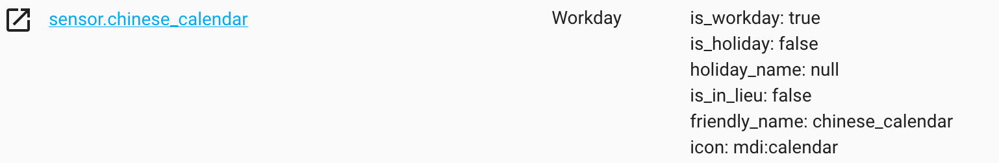

# home-assistant-chinese-calendar

使用 [chinese-calendar](https://github.com/LKI/chinese-calendar) 来判断今天是不是工作日/节假日。

会提供 `sensor.chinese_calendar` 这一 sensor。

## 安装

将 `custom_components/chinesecalendar` 目录复制到你的 Home Assistant 配置文件夹的 `custom_components` 目录下（如果没有该目录，则手动创建一个）。
参考： https://developers.home-assistant.io/docs/en/creating_component_loading.html

## 配置

```yaml
sensor:
  - platform: chinesecalendar
```

## 截图


